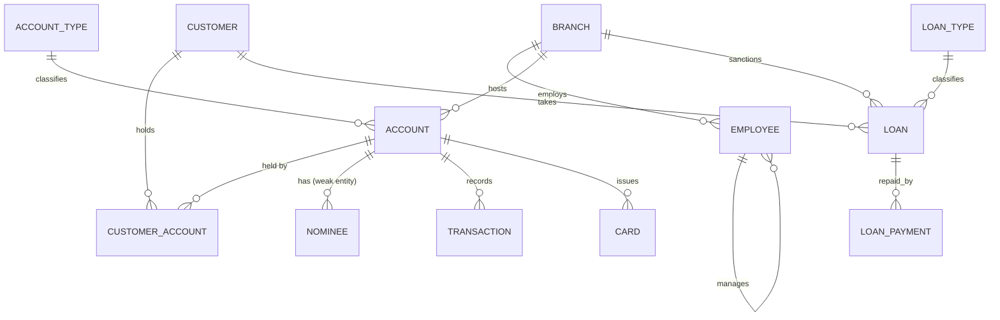

# 🏦 Bank Management System — MySQL Database Project

A complete relational database project for a **Bank Management System**, built
as an academic (DBMS coursework) submission in pure **MySQL 8.0+**. The project
implements the full pipeline taught in a typical Database Management Systems
course: ER modeling → normalization → relational schema → SQL DDL/DML →
constraints, views, indexes, triggers, stored procedures, and transaction
control.

---

## 📌 Table of Contents

- [Overview](#-overview)
- [Features](#-features)
- [Tech Stack](#-tech-stack)
- [Entity–Relationship Model](#-entityrelationship-model)
- [Database Schema](#-database-schema)
- [Normalization](#-normalization)
- [Repository Structure](#-repository-structure)
- [Getting Started](#-getting-started)
- [Usage Examples](#-usage-examples)
- [Concepts Demonstrated](#-concepts-demonstrated)
- [Known Limitations / Notes](#-known-limitations--notes)
- [Future Scope](#-future-scope)
- [Author](#-author)
- [License](#-license)

---

## 📖 Overview

This project models the core operations of a bank — customers, accounts,
branches, employees, loans, cards, nominees, and transactions — as a single
normalized MySQL database (`bank_management_system`). It was built to
demonstrate practical, hands-on command of relational database design and SQL,
covering everything from ER diagrams and normalization theory to triggers,
views, and stored procedures with transaction control.

> 🎓 **Academic context:** This project was developed as part of a Database
> Management Systems (DBMS) course covering ER modeling, the relational model,
> normalization, and advanced SQL.

---

## ✨ Features

- 13 interrelated tables covering customers, accounts, branches, employees,
  loans, cards, and nominees
- Full constraint set: primary/foreign keys, `CHECK`, `UNIQUE`, `ENUM` domains,
  composite keys
- A properly modeled **weak entity set** (`Nominee`) with a composite
  identifying key
- A many-to-many relationship (joint accounts) resolved through a bridge table
- 4 views, including a deliberate updatable-vs-non-updatable comparison
- 6 triggers for balance synchronization, overdraft prevention, audit
  logging, and automatic loan closure
- A stored procedure demonstrating full Transaction Control Language (TCL):
  `START TRANSACTION`, `SAVEPOINT`, `COMMIT`, `ROLLBACK`
- A workaround for two Oracle-only features MySQL lacks natively: sequences
  and synonyms
- 25+ example queries covering joins, subqueries, aggregate functions, set
  operations, and a genuine relational **division** query
- Realistic seed data so every query runs and returns meaningful results out
  of the box

---

## 🛠 Tech Stack

| Component | Choice |
|---|---|
| Database Engine | MySQL 8.0+ (InnoDB storage engine) |
| Language | Standard SQL (DDL, DML, DCL, TCL) |
| Tooling | MySQL Workbench / MySQL CLI / any MySQL-compatible client |

---

## 🧩 Entity–Relationship Model



> `NOMINEE` is a **weak entity set** — it has no independent primary key and
> cannot exist without its owning `ACCOUNT`. `CUSTOMER_ACCOUNT` is the bridge
> table resolving the many-to-many relationship between customers and
> accounts (e.g. joint accounts).

A full write-up of the ER model, cardinalities, participation constraints, and
common ERD pitfalls (fan trap / chasm trap) avoided in this design is in
[`ER_Model_and_Documentation.md`](./ER_Model_and_Documentation.md).

---

## 🗄 Database Schema

| Table | Purpose |
|---|---|
| `Branch` | Bank branch details |
| `Employee` | Staff, with a self-referencing manager hierarchy |
| `Customer` | Account holders |
| `Account_Type` | Lookup: SAVINGS / CURRENT / FIXED_DEPOSIT with interest rate |
| `Account` | Bank accounts |
| `Customer_Account` | Bridge table for joint/multi-holder accounts |
| `Nominee` | **Weak entity** — nominees for an account |
| `Transaction` | Deposits, withdrawals, transfers |
| `Loan_Type` | Lookup: HOME / PERSONAL / AUTO / EDUCATION |
| `Loan` | Customer loans |
| `Loan_Payment` | EMI/loan repayment history |
| `Card` | Debit/credit cards linked to accounts |
| `Audit_Log` | Trigger-populated change history |
| `Sequence_Generator` | Custom sequence simulation (MySQL has no native `SEQUENCE`) |

---

## 🧮 Normalization

The schema is normalized to **BCNF**, with an additional example showing a
**4NF** decomposition (why `Nominee` and `Card` are kept as separate tables
rather than merged). The full 1NF → 2NF → 3NF → BCNF → 4NF walkthrough — with
a concrete "before" (unnormalized) and "after" schema at each step — is in
[`ER_Model_and_Documentation.md`](./ER_Model_and_Documentation.md).

---

## 📂 Repository Structure

```
bank-management-system/
├── README.md                        # You are here
├── bank_management_system.sql       # Full project: schema, constraints,
│                                     #   views, triggers, procedures, seed
│                                     #   data, and 25+ example queries
└── ER_Model_and_Documentation.md     # ER model, normalization walkthrough,
                                      #   Codd's rules, relational algebra
                                      #   ↔ SQL reference
```

---

## 🚀 Getting Started

### Prerequisites
- MySQL Server **8.0 or newer** (8.0.31+ recommended — needed for the
  `INTERSECT`/`EXCEPT` example queries)
- A MySQL client: MySQL Workbench, DBeaver, or the `mysql` CLI

### Installation

1. Clone the repository:
   ```bash
   git clone https://github.com/<your-username>/bank-management-system.git
   cd bank-management-system
   ```

2. Run the script:
   ```bash
   mysql -u root -p < bank_management_system.sql
   ```
   This single command creates the database, all tables, views, triggers, a
   stored procedure, loads sample data, and runs the example query showcase.

3. Verify:
   ```sql
   USE bank_management_system;
   SHOW TABLES;
   SELECT * FROM View_Customer_Total_Balance;
   ```

> ⚠️ If you hit error `1418` when the script creates the `NEXT_VAL` function,
> your server has binary logging enabled. Run
> `SET GLOBAL log_bin_trust_function_creators = 1;` first (requires `SUPER`
> privilege), then re-run the script.

---

## 💡 Usage Examples

**Transfer funds between accounts (uses the TCL-driven stored procedure):**
```sql
CALL Transfer_Funds(2, 1, 15000.00, @status);
SELECT @status;
```

**Total balance held by each customer (aggregate view):**
```sql
SELECT * FROM View_Customer_Total_Balance;
```

**Customers who hold every account type offered (relational division):**
```sql
-- See Section 7.11 of bank_management_system.sql
```

**Branch-wise account summary:**
```sql
SELECT b.Branch_Name, COUNT(a.Account_No) AS Num_Accounts, SUM(a.Balance) AS Total_Balance
FROM Account a JOIN Branch b ON a.Branch_ID = b.Branch_ID
GROUP BY b.Branch_Name;
```

---

## 🎯 Concepts Demonstrated

- ER Model: entities, weak entity sets, cardinalities, participation
  constraints
- Relational Model: domains, keys, relational schemas
- Relational Algebra: selection, projection, joins, division, set operations,
  renaming — each mapped to its SQL equivalent
- Tuple Relational Calculus
- Normalization: 1NF, 2NF, 3NF, BCNF, multivalued dependencies, 4NF
- Codd's 12 Rules
- SQL: DDL, DML, TCL, aggregate functions, `GROUP BY`/`HAVING`, nested and
  correlated subqueries, all join types, `UNION`/`INTERSECT`/`EXCEPT`,
  conditional and conversion functions
- Views: updatable vs. non-updatable, security/column-restriction use cases
- Triggers and stored procedures
- Indexing for query performance

---

## ⚠️ Known Limitations / Notes

- MySQL has no native `CREATE SEQUENCE` or `CREATE SYNONYM` (unlike Oracle);
  this project includes documented workarounds (a sequence-generator table +
  function, and an alias view) rather than skipping those syllabus topics.
- `INTERSECT` and `EXCEPT` require MySQL **8.0.31+**. On older 8.0.x builds,
  substitute `IN` / `NOT IN` subqueries instead.
- This is an academic/learning project — it is **not** intended as a
  production-grade banking system (no encryption at rest for card numbers, no
  authentication layer, etc.).

---

## 🔭 Future Scope

- Add a role-based access layer (`GRANT`/`REVOKE`) for tellers vs. managers
- Build a front-end (e.g. a simple web or desktop client) on top of this schema
- Add stored procedures for full EMI schedule generation
- Partition the `Transaction` table by date for large-scale performance

---

## 👤 Author

## 👥 TEAM

| ROLE | NAME |
|:---|:---|
|  **GROUP LEADER** | *Samridh Mishra* |
| **MEMBER** | *Prafull Chaturvedi* |
| **MEMBER** | *Sajid Khan* |
| **MEMBER** |*Asutosh* |


B.Tech  — [COMPUTER SCIENCE]


Database Management Systems Course Project


Feel free to connect or raise an issue if you spot something to improve.

---

## 📄 License

This project is released under the [MIT License](LICENSE) — free to use,
modify, and distribute for academic or learning purposes.
